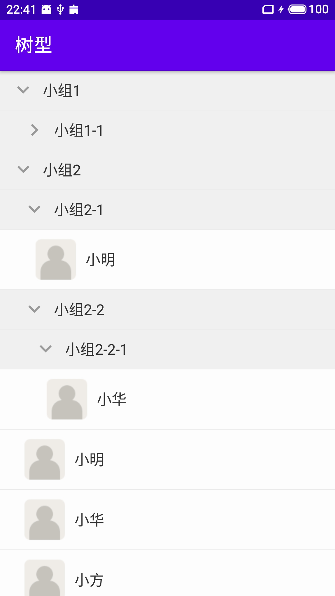
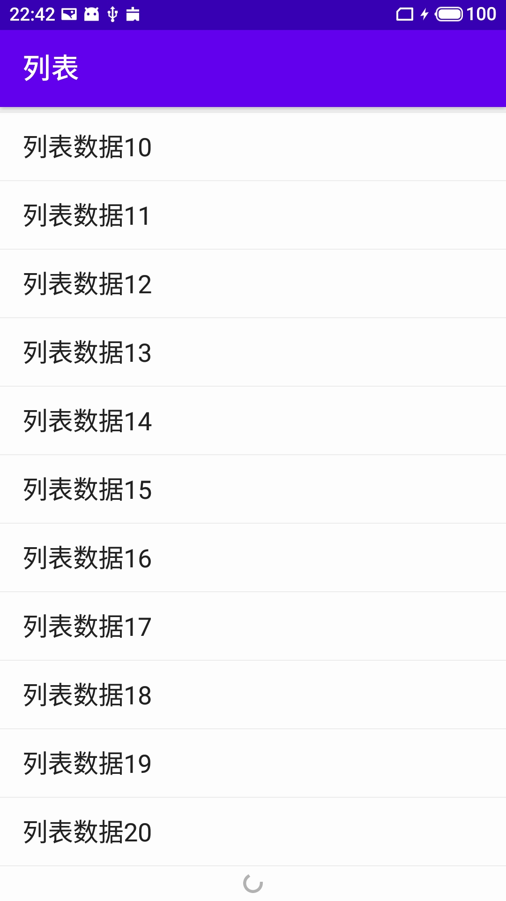

### 一套简易的数据绑定框架

通过该框架可实现view层的视图与viewModel层的get/is方法进行绑定，绑定后可在viewModel层直接调用notifyPropertyChanged方法通知视图做更新，或通过putNotifyLiveData将LiveData与get/is方法对应的枚举值进行绑定，进而实现LiveData数据更新后视图也随之更新。

该框架基于MVVM数据驱动的原理，主要利用apt技术解析@Binding注解，生成类似databinding的BR类和一些辅助类，从而帮助框架自动包装和关联需要被绑定的get/is方法，实现view-BR枚举类-get/is方法三者的关联关系，最终达到发送BR枚举类更新的通知后，自动调用get/is方法拿到最新值，并找到相应的view进行赋值。

使用方法

普通数据绑定

```java
ViewBinding viewBinding = new ViewBinding(this, MainViewModel.class);
viewBinding.bind(R.id.tv_sample_two_way_bind, new TextValueBinder(), BDR.computedInputText);
```

列表数据绑定

```java
ListViewBinding binding = new ListViewBinding(this, ListViewModel.class);
ListViewModel listViewModel = binding.getViewModel();
listViewModel.setResourceIdAndResource(
        new OnBindAdapterCallback() {
            @Override
            public void bind(ViewBinding binding, ViewGroup root, int viewType) {
                if (viewType == R.layout.list_item_tree_group) {
                    binding.bind(R.id.iv_tree_item_expand_group, new ImageValueBinder(), BDR.expandDrawable);
                    binding.bind(R.id.switcher_tree_item_group, (ValueBinder<ViewSwitcher, Boolean>) (view, value) -> view.setDisplayedChild(value ? 1 : 0), BDR.loading);
                }
            }
        }, R.layout.list_item_sample, listLiveData);
```

下面是示例的实现效果




